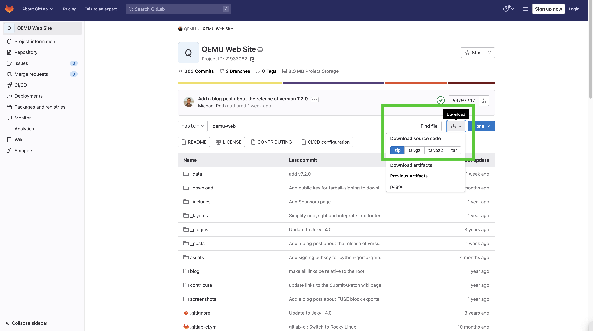

Deploying [qemu-web (fork)](https://github.com/QubitPi/qemu-web) to GitHub Pages
================================================================================

[qemu-web](https://github.com/QubitPi/qemu-web) is a standard github-jekyll. Executing

```bash
bundle exec jekyll build
```

will generate a gh-pages deployable under **_site** directory.

This fork publishes qemu-web website to `gh-pages` branch under `docs/` directory:

```bash
mv _site/ docs
```

Syncing [this Fork](https://github.com/QubitPi/qemu-web) with [Upstream on GitLab](https://gitlab.com/qemu-project/qemu-web)
---------------------------

**First of all, I hate GitLab, A LOT**

Fork syncing between GitHub and GitLab throws an error like the following:

```bash
$ git pull upstream main -v
Looking up gitlab.com ... done.
Connecting to gitlab.com (port xxxx) ... xxx.xxx.xxx.xxx done.
fatal: read error: Connection reset by peer
```

I never saw this embarrassing and stupid situation, so I decided to detach this fork completely from the upstream
(although I DO still declare this repo to be a _fork_ for clarification purpose).

Code updates are checked-in to **origin/master** branch **manually** by downloading source code directly from
[upstream](https://gitlab.com/qemu-project/qemu-web):



Next the `gh-pages` branch will **rebase** on top of `master` branch.

---

QEMU Website
============

This repository provides content for the QEMU website.

It uses the Jekyll site generator for turning the static content into
a format which can then be directly hosted by a regular HTTP server
such as Apache.


Testing locally with Jekyll
---------------------------

When adding/changing content on this site, it is possible to run a
local Jekyll service to test the result.

QEMU requires a specific version of Jekyll (listed in Gemfile) which may
not match that provided by your OS vendor. Thus as a one time step the
required Jekyll software should be installed locally:

* Install OS vendor ruby with development headers

   # sudo dnf install ruby ruby-devel   (Fedora)
   # sudo yum install ruby ruby-devel   (RHEL)
   # sudo apt-get install ruby ruby-dev (Debian / Ubuntu)

* Install OS vendor ruby gem bundler

   # sudo dnf install rubygem-bundler  (Fedora)
   # sudo yum install rubygem-bundler  (RHEL)
   # sudo apt-get install bundler      (Debian / Ubuntu)

* Install Jekyll and its dependencies

   # bundle install --path vendor

  NB this last command must be run from the qemu-web.git checkout
  root directory.

Jekyll is now installed into the 'vendor/' directory of the git checkout.
Note the 'vendor/' path has been explicitly excluded from the web content
in '_config.yml', so don't try to use a different path within the git
checkout.

To test the site launch jeykll

  # bundle exec jekyll serve

Now simply point a local web browser to http://127.0.0.1:4000 to browse
the generated site.

Jekyll will usually automatically detect changes to files in the git
checkout and regenerate the site. It is thus not normally necessary
to restart jekyll after changing content, unless it shows signs of being
confused / stale.
